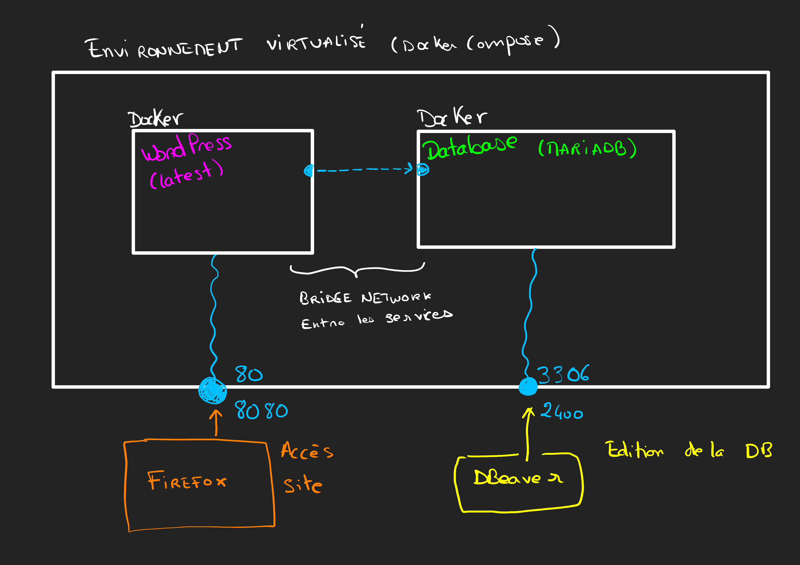

# Wordpress migration with Docker compose
Using docker compose allows us to build a full virtual environment where the website can be deployed and connected to an instance of database, and we can replay the procedure from scratch at any moment



It uses its internal network in order to connect all services.
Still, some ports are mapped to the host system, so that it is possible to edit the database from outside the container.

# Procedure to start up :

1. Build docker images and start the virtual environment
```sh
docker build -f Docker/MariaDb.Dockerfile -t vertical-database .
docker build -f Docker/Wordpress.Dockerfile -t vertical-wordpress .
docker compose -f Docker/docker-compose.yaml up

# Resetting databases and volumes :
docker compose -f Docker/docker-compose.yaml down -v
```

2. Open a DB editor (like DBeaver) and create a new MariaDb connection, on port 2400 (mapped in docker-compose file, check if different)
3. Go to `v34a_options` and edit :
* siteurl : from https://vertical-asso.fr -> http://localhost:8080
* home : from https://vertical-asso.fr -> http://localhost:8080
4. Disable broken theme
From `v34a_options` table :
* option 4x "template" : from vertical to twentytwenty*** -> check in wp-content/themes to see the available ones
* option 4x "stylesheet" : from vertical-child to twentytwenty*** -> check in wp-content/themes to see the available ones
5. Disable all plugins :
From `v34a_options` table :
set "active_plugins" to `a:0:{}`
6. Rewrite .htaccess file
.htaccess file causes issues it seems, rewrite it to :

In `/var/www/html/.htaccess`
```sh
# BEGIN WordPress
<IfModule mod_rewrite.c>
RewriteEngine On
RewriteBase /
RewriteRule ^index\.php$ - [L]
RewriteCond %{REQUEST_FILENAME} !-f
RewriteCond %{REQUEST_FILENAME} !-d
RewriteRule . /index.php [L]
</IfModule>
# END WordPress
```

7. Visit : "http://localhost:8080/wp-admin"
8. Go to the Extensions panel, select all extensions and update them.
9. Reactivate extensions one by one


# Debugging within the wordpress docker container
With vscode, attach to a running container and open the `/var/www/html/` folder.


